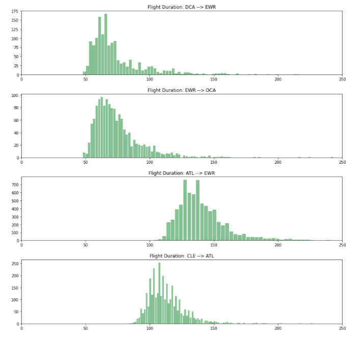
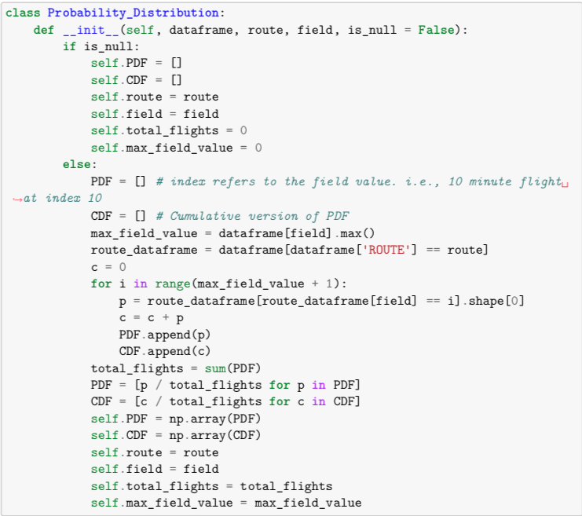
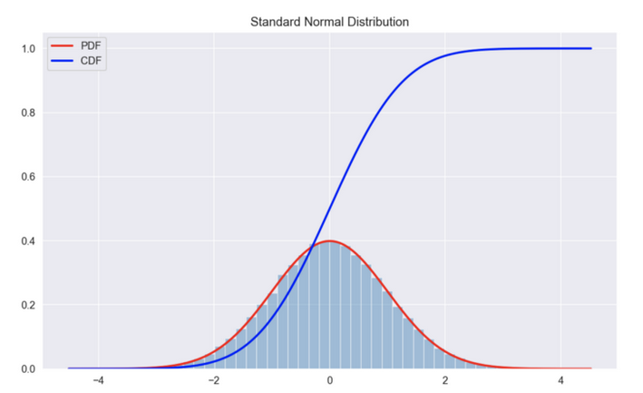
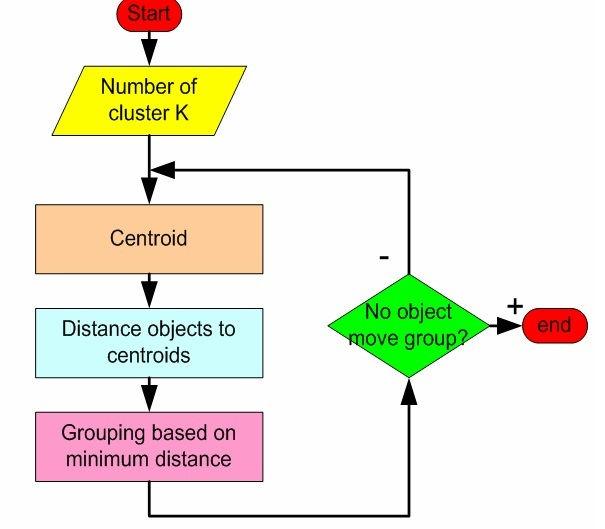
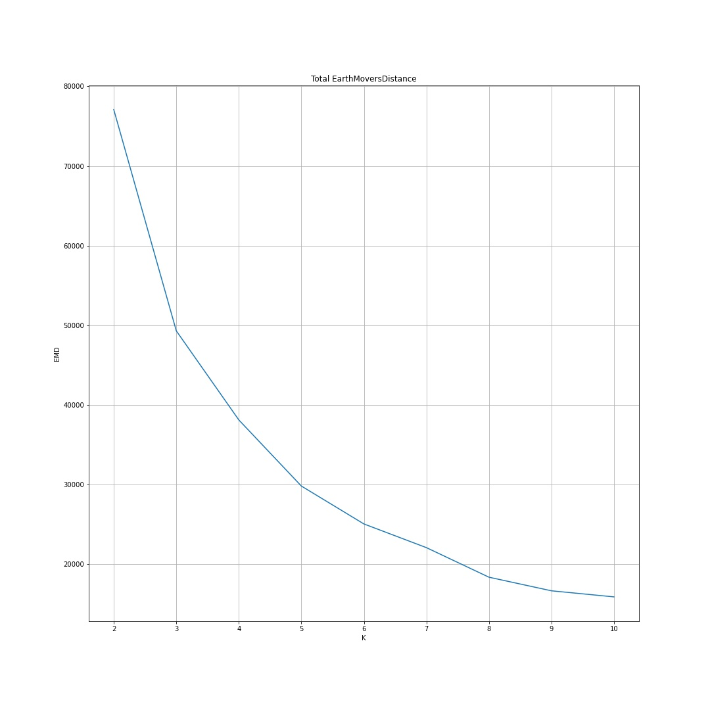

# Flight Data Clustering Using EP-Means

Brandon Sams

05Mar2021

## Problem

In data science, there are ofter clustering problems that require grouping data points together. There are plenty of industry standard methods to accomplish this, such as K-Means clustering and hierarchical clustering. However, a limitation of these methods is that it takes individual data points as the input. In some instances, distributions of data points need to be clustered, rather than individual points themselves. Traditional methods do not function well when dealing with distributions as input, at least without some modificaitons to the clustering method. 

There are many places where a distrbution clustering method would be beneficial, but this project will focus, specifically, on flight data. 

## Hypothesis/Research Question

This project aims to build upon the K-Means clustering method to function on a collection of distributions of data, rather that just a collection of data. 

K-Means is a method for clustering data that relies on two specific tasks to build clusters. They are:

1. Compute the average value for a cluster
2. Find the "distance" between two data points

## Literature

In the landmark 2015 paper, *EP-MEANS: An efficient nonparametric clustering of empirical probability distributions*, Henderson, Gallagher, and Elassi-Rad describe an extension on the traditional K-Means algorithm that accepts probability distributions as input. They propose that the two tasks mentioned previously can be implemented by:

1. Generating a Centroid Distribution, which is new distribution that is the simple mean of all input distributions
2. Calculating the Earth Mover's Distance between the Cumulative Distribution Functions (CDFs). This is the area between the two CDFs. 

Given these two adapted techniques, K-Means can almost be implemented. The only problem is that initial cluster centers have no way to be defined. Henderson, Gallager, and Elassi-Rad recommend using an improved method, kmeans++, that defines what the initial clusters ought to be. It involves choosing probability distributions from the original dataset, with a collection of weights that will likely minimize the number of iterations that need to be run in the final calculation.

## Dataset

The United States Bureau of Transportation requires idividual flight data to be publicly available. This makes an excellent dataset, because there are many distributions that can be clustered together. For example, flight duration is not a fixed value for a flight. There is some expected value for the duration of a flight, but it comes from a distribution of possible values. 

So the flight duration is a good continuous value that comes from the dataset, and there are plenty of categorical values that are also included. I ended up focusing on the route, as a categorical variable. Another possible option was to use airline. I didn't create one distribution per airline, becuase I wanted to have more distributions. That would make more fascinating clusters, in my opinion.

Pictured below are four examples of flight duration distributions, for 4 different flight routes. While the first two distributions probably ought to be clustered together, the other two would not belong to the same cluster.

## Data Preparation

### Constructing a DataFrame

The individual flight data has a lot of extra information, such as flight delays, departure/arrival time, and distance. I ended up removing most of the columns, and keeping just the following:

- FL_DATE
- OP_CARRIER
- ORIGIN
- DEST 
- CRS_ELAPSED_TIME
- ACTUAL_ELAPSED_TIME
- AIR_TIME
- DISTANCE

I added a new column, called "ROUTE", which was just the "ORIGIN" and "DEST", with an arrow --> between them. This field served as the category for splitting the data into distributions. I also removed rows with NA values, and removed any routes that contain less than 1000 flights.

I collected 10 years of flight data from the years of 2009-2018. Each year's data was stored as a separate csv. I merged all ten .csv files into a single file to make it easier to load into a dataframe.

While I only really ended up using the ROUTE and ACTUAL_ELAPSED_TIME fields for this analysis, it could be repeated with AIR_TIME or CRS_ELAPSED_TIME, and likely get very similar clusters out of it.

### Constructing Distributions

The analysis was run in a jupyter notebook, so I decided that this would be a good time to write a class for making probability distributions.

Using this class, I could pass in the entire dataframe, along with a few more configuration details, and create a probability distribution. Notably, these probability distributions contain a Probability Density Function (think about histograms pictured earlier), and a Cumulative Distribution function. Here is an image of the difference between the two.

The CDF measures the cumulative percent of the data points that are present, up to a given point, starting at the left.

## Computing EP-Means

Now that the data has been transformed into a collection of probability distributions, we need to measure the "Distance" between distributions, and we also need a way to compute the average distribution for a collection of distributions.

To accomplish this first task, we can compute the Earth Mover's Distance (EMD), also sometimes referred to as the Wasserstein Metric. This is the raw area between the CDFs of two probability distributions. Two very similar distributions will have a very low EMD, and vice versa.

In order to compute the average distribution for a collection of distributions, this involves averaging all the PDFs together. This is straightforward for this dataset, as the flight duration is always in minutes, with no partial values. So the average value at m minutes is the average of the other distributions' values at m minutes. Repeat this for all values, and an average distribution is created.

Given these two techniques, KMeans Clustering can be completed. Choose some disributions to serve as cluster centers, and get going. Cluster the data around the centers, and recompute the centers based on the new groupings. Repeat until no items change clusters.

## Results

The dataset contained just over 2000 routes, each of which has a probability distribution that describes the flight duration. EP-Means requires that the number of clusters be decided prior to clustering. But as an example, here are the resulting clusters for K=5.

Of course, any value of K>1 would do, but K=5 appears to be a pretty good value for this specifc set of distributions. For larger values of k, the rightmost cluster would have very few values included.

The chart below shows the total Earth Mover's Distance, across all clusters, for various values of K. 

## Conclusion

This project showed an implementation of EP-Means, a modified version of K-Means that functions with distributions as input, rather than individual data points. Data was able to be clustered, regardless of this difference. This simply required that Earth Mover's Distance be used as the distance metric between the distributions, and that a centroid distrbution could be computed for a collection of distributions, by averaging the Probability Density Functions for each distribution in the collection.

Total Earth Mover's Distance was used as a performance metric for the clustering algorithm, and showed that for this specific dataset, 5 clusters is probably the best option.

## References

2015 flight delays and cancellations. (n.d.). Retrieved February 14, 2021, from https://kaggle.com/usdot/flight-delays

	This dataset offers a large download of historical data, broken down by flight. (600MB) I plan to start the analysis with this dataset, as it is very comprehensive and appears complete. Data is from 2015.

Airline on-time performance statistics—Dataset by dot. (n.d.). Data.World. Retrieved February 14, 2021, from https://data.world/dot/airline-on-time-performance-statistics

	This dataset is very similar to the above dataset, with the exception that the data is from 2018. Perhaps this will give us a look into how clustering may have changed over time.

Aviation data & statistics. (n.d.). [Template]. Retrieved February 14, 2021, from https://www.faa.gov/data_research/aviation_data_statistics/

	This is where the FAA hosts a large amount of statistical data for research, directly related to the airline industry.

chilamkurthy, K. (2020, October 23). Wasserstein distance, contraction mapping, and modern rl theory. Medium. https://towardsdatascience.com/wasserstein-distance-contraction-mapping-and-modern-rl-theory-93ef740ae867

	EP-Means relies on the ability to find the “distance” between two distributions. This article goes into a specific way of measuring distance called the “Wasserstein Distance”, and connects this metric to modern Reinforcement Learning.

Clustering probability distributions—Methods & metrics? (n.d.). Cross Validated. Retrieved February 14, 2021, from https://stats.stackexchange.com/questions/13186/clustering-probability-distributions-methods-metrics

	This stackexchange discussion shows some alternatives to EP-Means clustering.

Epmeans: Ep-means algorithm for clustering empirical distributions in maotai: tools for matrix algebra, optimization and inference. (n.d.). Retrieved February 14, 2021, from https://rdrr.io/cran/maotai/man/epmeans.html

	This is the documentation page for a specific R package that is used for computing EP Means.

Henderson, K., Gallagher, B., & Eliassi-Rad, T. (2015). EP-MEANS: An efficient nonparametric clustering of empirical probability distributions. Proceedings of the 30th Annual ACM Symposium on Applied Computing, 893–900. https://doi.org/10.1145/2695664.2695860

	This is the landmark paper where I originally discovered EP Means. It highlights the efficiencies of this technique in regards to other distribution clustering techniques, and shows how one might implement this technique. 

Olive, X., Strohmeier, M., & Lübbe, J. (2021). Crowdsourced air traffic data from The OpenSky Network 2020 [Data set]. Zenodo. https://doi.org/10.5281/ZENODO.3737101

	Another possible source of air traffic data. Data is from 2020. Data contains firstseen and lastseen properties, so duration can be computed.

Panaretos, V. M., & Zemel, Y. (2019). Statistical aspects of wasserstein distances. Annual Review of Statistics and Its Application, 6(1), 405–431. https://doi.org/10.1146/annurev-statistics-030718-104938

	Detailed review of Wasserstein distances (possibly showing multiple types?)

Ye, J., Wu, P., Wang, J. Z., & Li, J. (2017). Fast discrete distribution clustering using wasserstein barycenter with sparse support. IEEE Transactions on Signal Processing, 65(9), 2317–2332. https://doi.org/10.1109/TSP.2017.2659647

	Shows how Wasserstein distance can be used to cluster distributions, but no explicit mention of EP means appears to be present in this paper. 
